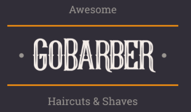

<p align="center">
  <a>
    
  </a>
</p>

<p align="center">
  App para agendamento de horários em barbearias.
</p>

<p align="center">
  <a>
    
  </a>

  <a>
    
  </a>

  <a>
    
  </a>

  <a>
    
  </a>

</p>


## Conteúdo

- [Funcionalidades](#funcionalidades)
- [Instalação](#instalacao)
- [Feedback](#feedback)
- [Agradecimento](#agradecimento)

## Funcionalidades

O app do GoBarber permitirá:

* Login e cadastro de usuários
* Agendamento de horários na barbearia

OBS: O projeto precisa da API e do sistema WEB, que serão disponibilizados aqui em breve.

<p align="center">
  
</p>

<p align="center">
  
</p>

<br>

## Instalação

Para clonar o repositório:

```
  git clone https://github.com/wesleymonaro/go_barber_app.git go_barber_app
```

Para instalar as dependências:

```
  yarn install or npm install
```

Para rodar a aplicação:

```
  yarn start or npm start
```


## Agradecimento

Agradecimento especial a [Rocketseat](https://rocketseat.com.br/) que contribuiu com o design e ensinaementos durante o desenvolvimento.
